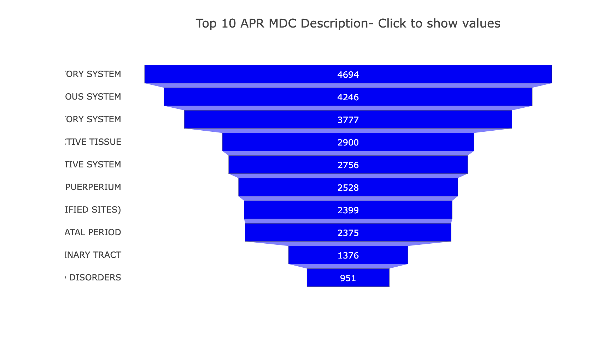

# NY-Healthcare-Data-Visualization

# Project Idea

Visualization of discharge data for NY healthcare systems in 2022. 

# Data Source

https://healthdata.gov/State/Hospital-Inpatient-Discharges-SPARCS-De-Identified/43pi-8a8k/about_data

- NY Health Data for 2022

# Group Members 
Dave Burgman, Esha Patel, Kamilla Ribeiro

# Hypothesis 
 
### PROJECT OUTINE

* Select the real-world data set.
* Download the dataset and convert it into a Pandas DataFrame.
* Perform data cleaning/deal with missing values using Pandas and NumPy.
* Plot interactive graphs to understand the data using visual libraries like leaflet and create a dashboard with user-driven interations such as dropdowns menu and has three views. 
* Data is stored in MongoDb. 
* Analysis of the data.

# Analysis
1. Data Overview:
- The dataset contains information about hospital inpatient discharges from New York State.
- It includes various attributes such as hospital service area, county, facility name, patient demographics (age, gender), diagnoses (APR MDC description), payment typologies, total charges, and total costs.

2. Data Cleaning and Preprocessing:
- We cleaned the data using pandas by dropping confidential records, merging latitude and longitude data so we can map our hospital facilites, and converting columns to appropriate data types.

3. Descriptive Statistics:

Summary statistics can be calculated for numerical variables like total charges and total costs. Categorical variables such as gender, race, and payment typologies can be analyzed for frequency distributions.

4. Visualization:

- We have created 3 Heatmaps to visualize the distribution of payment typologies across different healthcare facilities. First heat map shows government insurance such as Medicaid, Medicare, Etc. Second heathmap shows us private insurance. The last heat map shows us other type of payments such as self pay, etc. The geographic plot can be used to visualize the location of healthcare facilities in New York State.

- On our dashboard, we have created a dropdown menus for Facility Names. Once you choose a option for Facility name, you will get a bar chart showing the total cost, total charges and total count per MDC Description. You will also be able to see a Pyramid chart with the top 10 APR MDC Description to see the most and least likey reason someone was admitted into the hospital. Last, you will see a pie chart that shows the average length of stay per APR MDC Description per facility. 

- We have created marker maps which show us the governmenet and private insurance per hospital. It shows the average length of stay, average total costs and and average total charges for the insurance type. 

5. Trends and Patterns:

- Payment Typologies:
We can examine trends in payment typologies over time and analyze the distribution of payment methods across different healthcare facilities.
Understanding payment trends can provide insights into the healthcare financing landscape and patients' insurance coverage.
Demographic Analysis:

We can analyze the demographic composition of hospital discharges, including age groups, genders, races, and ethnicities.
Identifying demographic patterns can help identify disparities in healthcare access and utilization.

Correlation Analysis:

We can examine correlations between numerical variables such as length of stay, total charges, and total costs. This will help us understand how these variables relate to each other.
We can calculate correlation coefficients (e.g., Pearson correlation) and visualize the correlations using heatmaps or scatter plots.
Diagnoses and Procedures:

We can analyze the distribution of diagnoses (APR MDC descriptions) and procedures to identify any prevalent conditions or frequently performed treatments.
Visualizing the frequency of diagnoses and procedures can help us identify patterns in healthcare utilization.

#### Data Visulaization:

- Marker Maps

Government Insurance

Private Insurance 

- Dashboard

- Heat Maps

Government Insurance

Private Insurance 

Other Insurance Types

